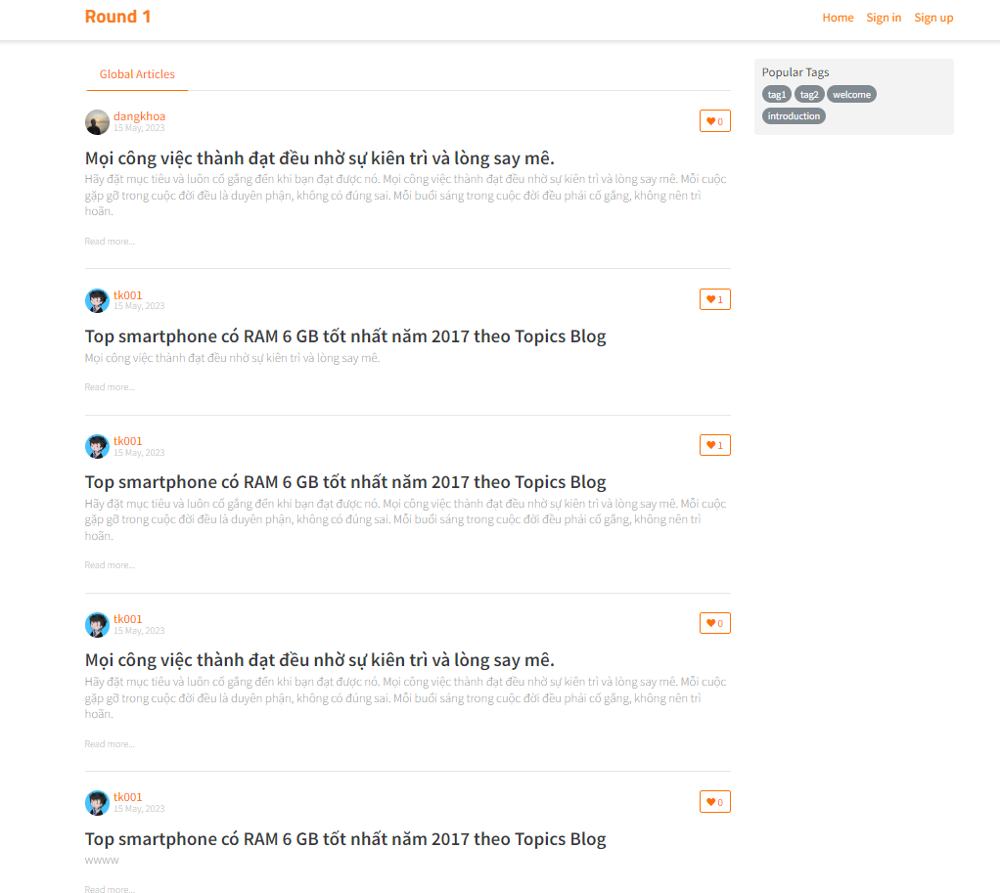
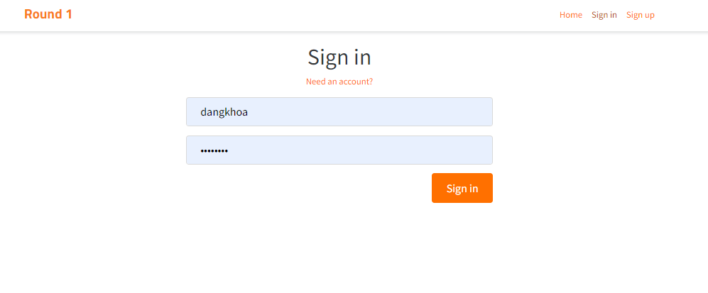
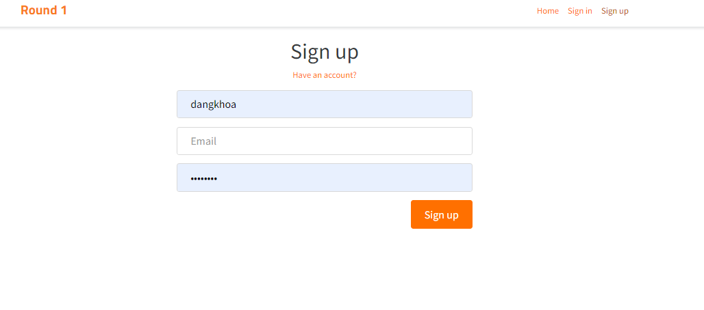
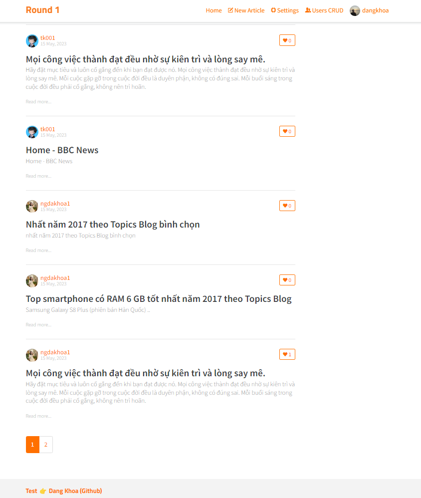
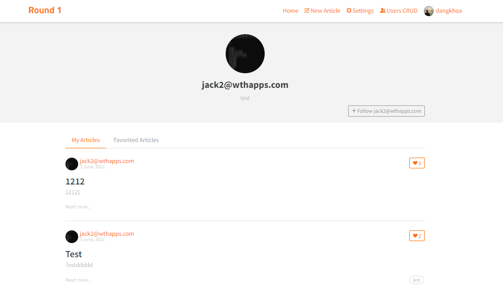
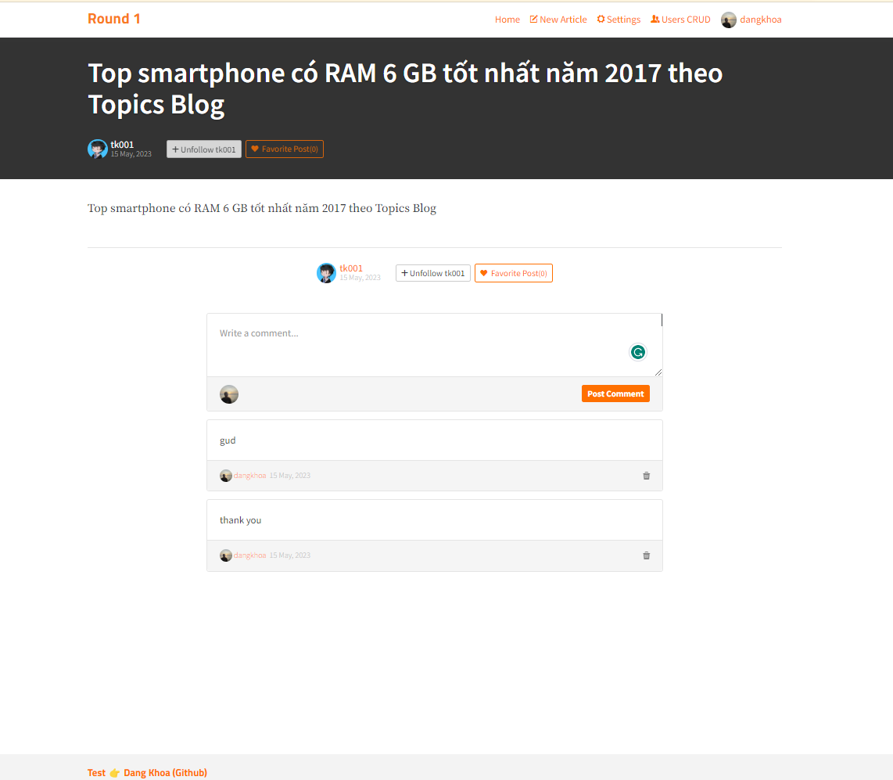
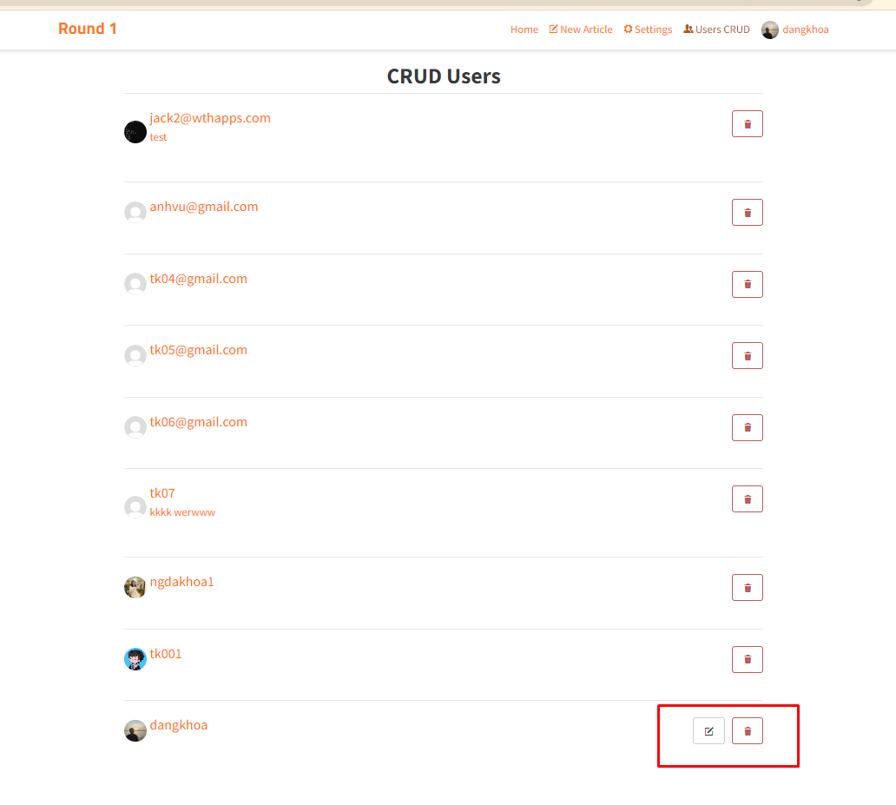
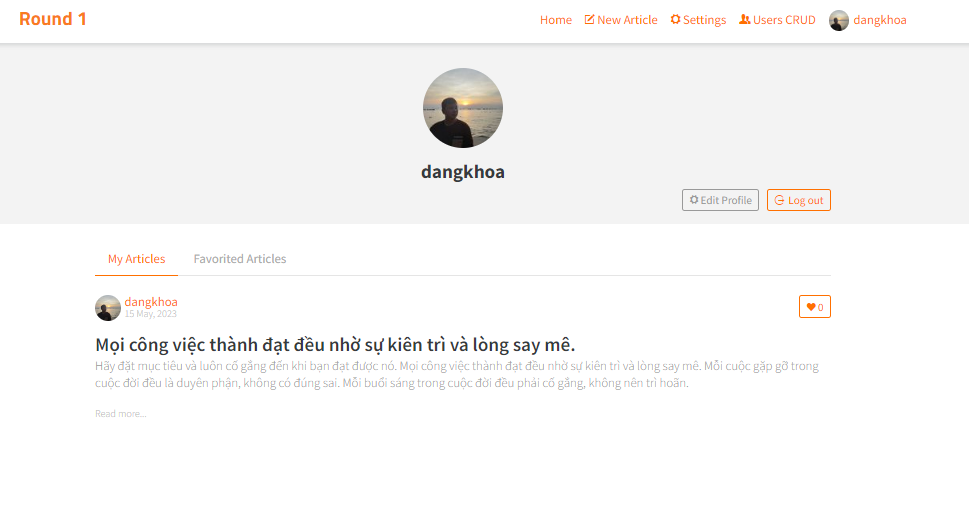
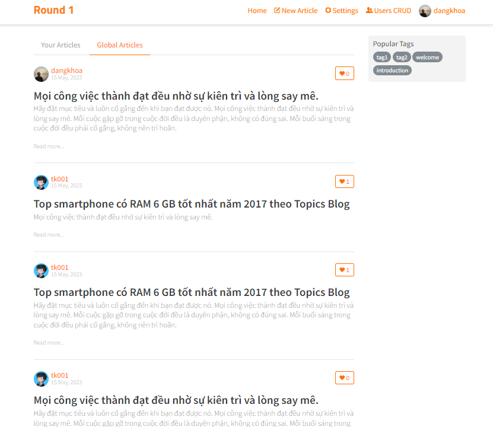
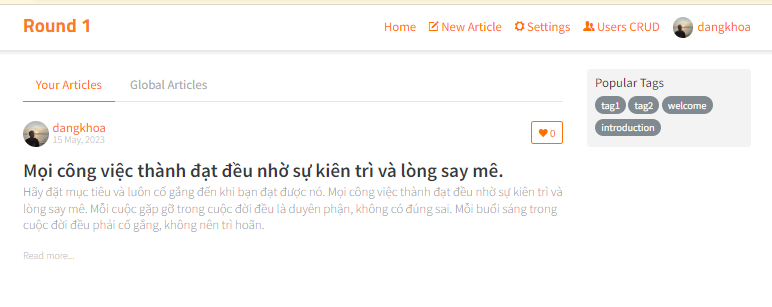

### This is `ui-challenge-frontend` developed by @khoa

## Table of Contents
- [Table of Contents](#table-of-contents)
- [Technologies Used](#technologies-used)
- [Features](#features)
- [Screenshots](#screenshots)
- [Setup](#setup)
  - [Setup Env:](#setup-env)
- [Contact 📱](#contact-)

## Technologies Used
- ReactJS, Bootstrap
- Recoil: Using Recoil to manage state instead of Redux
- Axios: Making API calls
- LocalStorage: JWT
- Typescript: Clean code
- Form: Bootstrap form basics
- @testing-library/react: Login form -> `npm run test` to run unit tests
- Eslint: Enforcing consistent coding styles and identifying potential errors in TS code
- NVM: Node version `v14.21.3`
  
## Features
List of ready features:

- Login, Register, Logout, JWT
- Users CRUD:
  - EDIT yourself
  - VIEW user details
  - DELETE other users
  
- Articles:
  - LIST articles: Your articles, Global articles
  - VIEW details by one click
  - CREATE a new article
  - EDIT/DELETE your articles
  - Follow admin, Like article
- Comment:
  - List comments
  - CREATE a new comment
  - Comment details
- Units Test: LoginForm => `passed`
- Responsive
- Pagination
## Screenshots

## Setup

CMD
`cd client`
`yarn install`
`yarn start`

open new terminal
`npm install`
`npm start`

### Setup Env:
`npm i`  or  `yarn`: Install all packages

`npm start`: Runs the app in development mode.\
Open [http://localhost:3001](http://localhost:3001) to view it in the browser. 
👉 (Because Backend is running at http://localhost:3000)

`npm test`: Launches the test runner in the interactive watch mode.\
See the section about [running tests]

`npm run build`: Builds the app for production to the `build` folder.

## Contact 📱

Created by [@DangKhoa Nguyen](https://portfolio-khoa25200.vercel.app/) - feel free to contact me!
